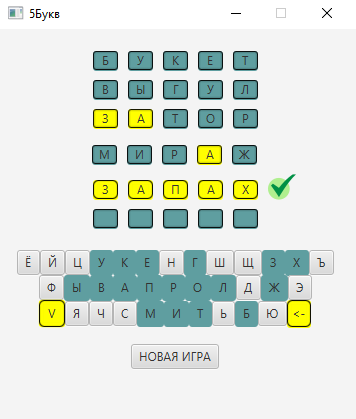

#                                           Letter5

### Программа является реализацией игры 5Букв.

### Особенности

- Пользовательский интерфейс разработан на JavaFX.
- Программа является Desktop приложением.
- При нажатии на кнопку "Новая игра" игровая сессия обновляется.
- В полях ввода слова желтым подсвечиваются буквы, находящиеся на своих местах. Белым подсвечиваются буквы присутствующие в слове, но расположенные на другом месте.

